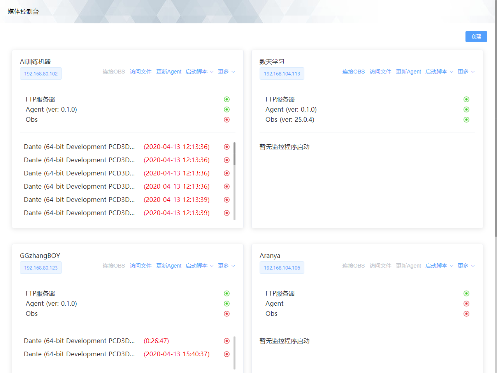
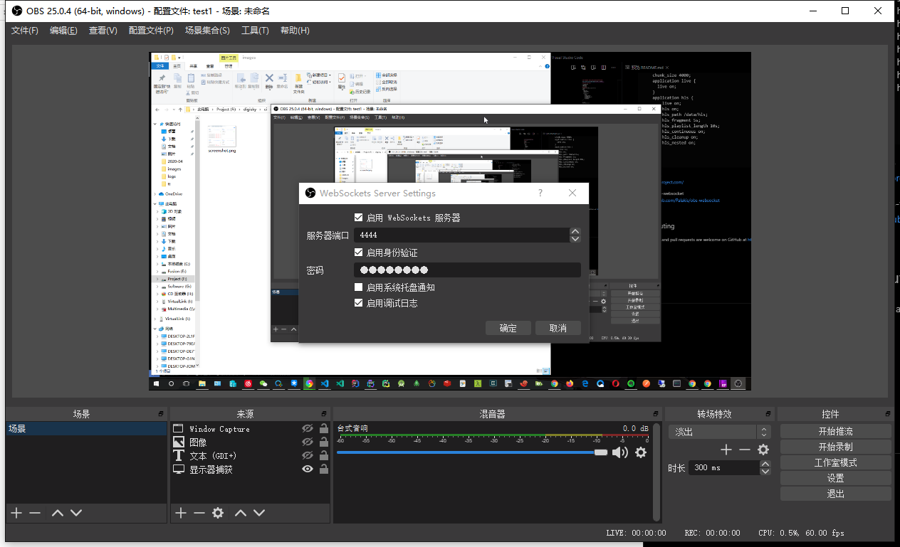

# Knife | Boardcast, resource access, and proxy execution scripts

Knife是一个可以查看主机串流视频，访问资源，以及代理执行脚本的平台


## What makes Knife special?

* 多路直播串流管理
* ftp文件访问
* 代理执行脚本
* 运行窗口监控

## Installation
1，安装串流服务器（默认使用nginx with rtmp)
```conf
rtmp {
  server {
    listen 1935;
    chunk_size 4000;
    application live {
      live on;
    }
    application hls {
        live on;
        hls on;
        hls_path /data/hls;
        hls_fragment 5s;
        hls_playlist_length 10s;
        hls_continuous on;
        hls_cleanup on;
        hls_nested on;
    }
  }
}
```

2，安装OBS  
https://obsproject.com/

3，安装OBS-websocket  
https://github.com/Palakis/obs-websocket  
配置obs-websocket


4，构建并运行agent
```bash
go build -o /path/agent-$version -ldflags "-X main.buildVersion=$version"

/path/agent-$version
```

5，配置rtmp地址和播放地址  
web/config/index.js
```js
export default {
  rtmpServer: "rtmp://xxx.xxx.xxx.xxx:xxx",
  videoServer: "http://xxx.xxx.xxx.xxx:xxx"
}
```

## Contributing

Bug reports and pull requests are welcome on GitHub at https://git.ppgame.com/ops/obs-dashboard